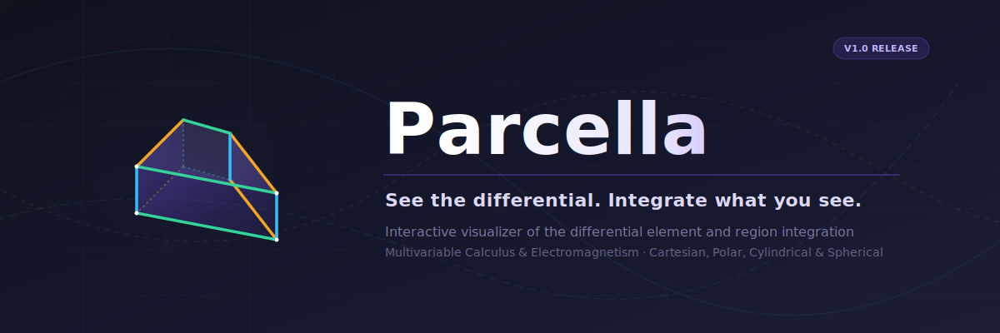

<p align="right"><a href="README.md">🇪🇸 Español</a> · <b>🇬🇧 English</b></p>

<div align="center">



[](https://kegouro.github.io/parcella/)
[](https://github.com/kegouro/parcella/actions/workflows/ci.yml)
[](https://github.com/kegouro/parcella/actions/workflows/deploy.yml)


<br>


</div>

---

When teaching multiple integrals, solids of revolution, or electromagnetism, it is hard to show **what
a differential looks like** and what it means to integrate over only some variables: *in $r$ yes, in
$\theta$ halfway, in $\phi$ no*. **Parcella** makes it visible. A tiny infinitesimal piece — a
*parcella* — **sweeps** the region according to which variables you integrate and which you freeze,
while the differential is assembled term by term and the integral accumulates in real time. And **each
coordinate has its own color**: the same color tints its factor in the formula, its slice in the 3D
figure, and its slider — so you can see at a glance *which integral builds which part*.

<br>

## Two ways to use it

<table>
<tr>
<td width="50%" valign="top">

### ◰ Explore

Define a region, choose the integrand, and **watch the sweep**.
Each variable has a **slider with its color**: drag it and observe
how that integral fills its part of the figure and how much it adds to
the total.

Freeze a variable and the element drops one dimension:
that way you *see* the difference between a volume, a surface, and a curve.

</td>
<td width="50%" valign="top">

### ◳ Derive

A **guided geometric derivation**, step by step. The element
is built edge by edge and each one appears **labeled with its
length** ( $dr$, $r\,d\theta$, $r\sin\theta\,d\phi$ ) anchored in 3D space.

Ideal for helping students understand *where each factor of the
Jacobian comes from*, rather than just memorizing it.

</td>
</tr>
</table>


<br>

## Features

| | |
|---|---|
| **Sweeping element** | The differential traverses the region according to the active variables: point → curve → surface → solid. |
| **Color-coded decomposition** | Each coordinate has its own color (radial, polar, azimuthal), consistent across the formula, sliders, and 3D figure. |
| **Slider per variable** | A progress control for each integral; see how each one evolves and which zone contributes. |
| **Differential term by term** | Each factor is the physical arc length of the real arc, in LaTeX (KaTeX). |
| **Accumulated integral** | Live value with progress bar — length, area, or volume; or $\int f$, flux, and circulation. |
| **Four coordinate systems** | Cartesian, **polar (2D)**, cylindrical, and spherical, each with its correct Jacobian. |
| **Curvilinear coordinates** | Define your own mapping $(u,v,w)\to(x,y,z)$ and watch the Jacobian emerge (with tutorial). |
| **Three ways to define the region** | Preset library · manual limits with expressions · **inequalities** that deduce the bounds. |
| **Full integrand** | Geometric ($1$), scalar field $f$, and vector field $\vec{F}$ with flux $\iint \vec{F}\cdot d\vec{S}$ and circulation $\oint \vec{F}\cdot d\vec{l}$. |
| **Designed for teaching** | Quick start on launch, persistent guide, and guided **Derive** mode. |
| **Built for sharing** | State serialized in the URL, **PNG** and **GIF** export of the sweep. |
| **Web + desktop** | Runs in the browser (GitHub Pages) and as a desktop app (Electron). |

<br>

## The math

Each coordinate system contributes its own scale factor. In Parcella, **each factor is the physical arc
length** that the element travels when varying that coordinate — that is why their product is the
Jacobian:

| System | Element |
|---|:---|
| Cartesian | $dV = dx\,dy\,dz$ |
| Polar (2D) | $dA = r\,dr\,d\phi$ |
| Cylindrical | $dV = \rho\,d\rho\,d\phi\,dz$ |
| Spherical | $dV = r^2\sin\theta\;dr\,d\theta\,d\phi \;=\; \underbrace{dr}_{r}\cdot\underbrace{r\,d\theta}_{\theta}\cdot\underbrace{r\sin\theta\,d\phi}_{\phi}$ |

> Spherical convention (physics / ISO): polar $\theta \in[0,\pi]$ from the $+z$ axis, azimuthal $\phi \in[0,2\pi)$ in the $xy$ plane.
> Freezing a variable reduces the element's dimension: $dV \to dS \to dl$.

The engine is **validated with SymPy** (Jacobians, scale factors, and volumes of the presets) and
covered by **463 tests** (Vitest).

<br>

## Architecture

Strict separation between the **engine** and the **interface**, with a clear dependency rule:
`ui/` and `render/` depend on `core/`, **never the other way around**.

<details>
<summary><b>View <code>src/</code> structure</b></summary>

```
src/
  core/                  # PURE mathematical engine (no DOM, no Three.js) — 100% testable
    coords      ·  coordinate systems: cartesian, polar, cylindrical, spherical, curvilinear
    region      ·  region = system + 3 variables with bounds (constants or dependent)
    library     ·  presets (ball, spherical cap, cylinder, cone, torus, paraboloid, disk…)
    inequalities·  inequalities → deduces the bounds
    differential·  swept geometry + differential expression term by term
    fields      ·  scalar field f and vector field F (flux, circulation)
    integrate   ·  cumulative numerical integration
    derivation  ·  lessons for the guided derivation (generated from scale factors)
    colors · format · parser · state
  render/                # Three.js: scene, element, sweep, coordinate grid, fields, 3D labels
  ui/                    # DOM + KaTeX: panel, equations, transport, derivation, tutorial, curvilinear
  services/              # URL sharing, PNG export, GIF recording
  app.ts                 # orchestrates ui ↔ core ↔ render
electron/                # desktop app (mac · win · linux)
```

</details>

<br>

## Development

```bash
npm install
npm run dev        # development server (Vite)
npm run build      # type-check + production build
npm test           # test suite (Vitest)
npm run app        # desktop app (Electron)
npm run dist:mac   # package — also :win and :linux
```

**Stack:** TypeScript · Vite · Three.js · KaTeX · math.js · Vitest · Electron.

<br>

---

<div align="center">

Made by **José Labarca** — sibling of [Curvana](https://github.com/kegouro/curvana).
[MIT](LICENSE) license.

</div>
