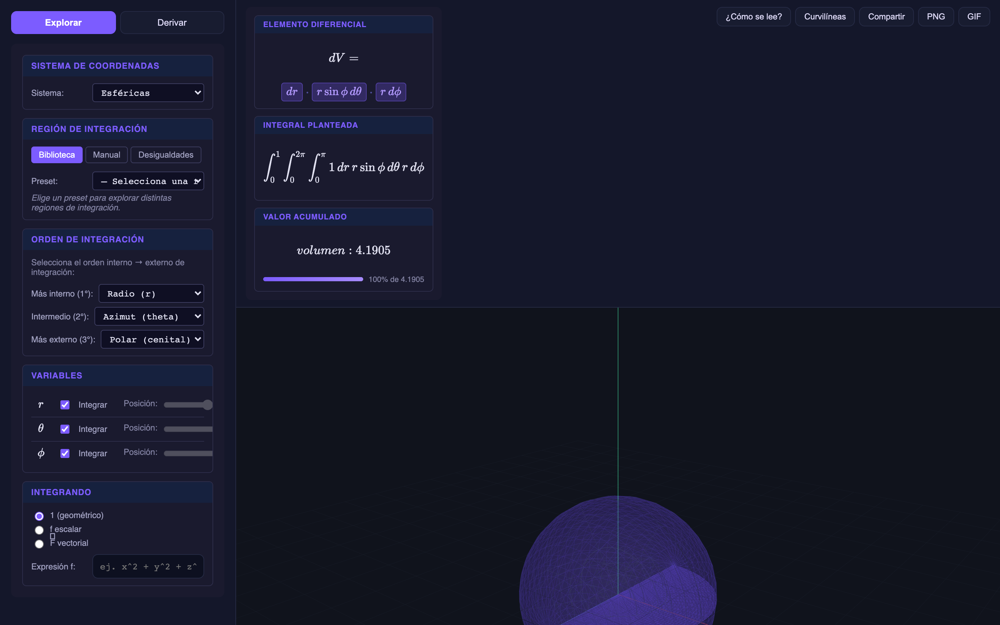
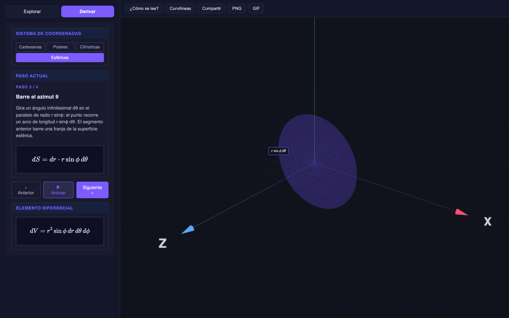

<p align="right"><b>🇪🇸 Español</b> · <a href="README.en.md">🇬🇧 English</a></p>

<div align="center">

# Parcella

### Mira el diferencial. Integra lo que ves.

Visualizador interactivo del **elemento diferencial** ( $dl$ · $dS$ · $dV$ ) y de la integración por
regiones, para **Cálculo multivariable** y **Electromagnetismo**.

[](https://kegouro.github.io/parcella/)

[](https://github.com/kegouro/parcella/actions/workflows/ci.yml)
[](https://github.com/kegouro/parcella/actions/workflows/deploy.yml)


<br>



</div>

---

Al enseñar integrales múltiples, sólidos en revolución o electromagnetismo, cuesta mostrar **qué pinta
tiene** un diferencial y qué significa integrar solo en algunas variables: *en $r$ sí, en $\theta$ hasta
la mitad, en $\phi$ no*. **Parcella** lo vuelve visible. Un trocito infinitesimal —una *parcella*—
**barre** la región según qué variables integras y cuáles congelas, mientras el diferencial se arma
término a término y la integral se acumula en vivo. Y **cada coordenada tiene su color**: el mismo color
tiñe su factor en la fórmula, su rebanada en la figura 3D y su slider — así se ve, de un vistazo, *qué
integral construye qué parte*.

<br>

## Dos formas de usarlo

<table>
<tr>
<td width="50%" valign="top">

### ◰ Explorar

Define una región, elige el integrando y **mira el barrido**.
Cada variable tiene un **slider con su color**: deslízalo y observa
cómo esa integral va llenando su parte de la figura y cuánto suma al
total.

Congela una variable y el elemento baja de dimensión:
así *ves* la diferencia entre un volumen, una superficie y una curva.

</td>
<td width="50%" valign="top">

### ◳ Derivar

Una **derivación geométrica guiada**, paso a paso. El elemento
se construye arista por arista y cada una aparece **rotulada con su
longitud** ( $dr$, $r\,d\theta$, $r\sin\theta\,d\phi$ ) anclada en el espacio 3D.

Ideal para que el estudiante entienda *de dónde sale* cada factor del
jacobiano, no que lo memorice.

</td>
</tr>
</table>



<br>

## Características

| | |
|---|---|
| **Elemento que barre** | El diferencial recorre la región según las variables activas: punto → curva → superficie → sólido. |
| **Descomposición por colores** | Cada coordenada tiene su color (radial, polar, azimutal), consistente entre la fórmula, los sliders y la figura 3D. |
| **Slider por variable** | Un control de progreso por cada integral; ve cómo cada una evoluciona y qué zona aporta. |
| **Diferencial término a término** | Cada factor es la longitud física del arco real, en LaTeX (KaTeX). |
| **Integral acumulada** | Valor en vivo con barra de progreso — longitud, área o volumen; o $\int f$, flujo y circulación. |
| **Cuatro sistemas** | Cartesianas, **polares (2D)**, cilíndricas y esféricas, cada uno con su jacobiano correcto. |
| **Coordenadas curvilíneas** | Define tu propio mapeo $(u,v,w)\to(x,y,z)$ y mira surgir el jacobiano (con tutorial). |
| **Tres formas de definir la región** | Biblioteca de presets · límites manuales con expresiones · **desigualdades** que deducen los límites. |
| **Integrando completo** | Geométrico ($1$), campo escalar $f$, y campo vectorial $\vec{F}$ con flujo $\iint \vec{F}\cdot d\vec{S}$ y circulación $\oint \vec{F}\cdot d\vec{l}$. |
| **Pensado para enseñar** | Inicio rápido al abrir, guía permanente y el modo **Derivar** guiado. |
| **Para compartir** | Estado serializado en la URL, export **PNG** y **GIF** del barrido. |
| **Web + escritorio** | Corre en el navegador (GitHub Pages) y como app de escritorio (Electron). |

<br>

## La matemática

Cada sistema aporta su propio factor de escala. En Parcella, **cada factor es la longitud física del
arco** que recorre el elemento al variar esa coordenada — por eso su producto es el jacobiano:

| Sistema | Elemento |
|---|:---|
| Cartesianas | $dV = dx\,dy\,dz$ |
| Polares (2D) | $dA = r\,dr\,d\phi$ |
| Cilíndricas | $dV = \rho\,d\rho\,d\phi\,dz$ |
| Esféricas | $dV = r^2\sin\theta\;dr\,d\theta\,d\phi \;=\; \underbrace{dr}_{r}\cdot\underbrace{r\,d\theta}_{\theta}\cdot\underbrace{r\sin\theta\,d\phi}_{\phi}$ |

> Convención esférica (física / ISO): $\theta$ polar $\in[0,\pi]$ desde el eje $+z$, $\phi$ azimutal $\in[0,2\pi)$ en el plano $xy$.
> Congelar una variable baja la dimensión del elemento: $dV \to dS \to dl$.

El motor está **validado con SymPy** (jacobianos, factores de escala y volúmenes de los presets) y
cubierto por **463 tests** (Vitest).

<br>

## Arquitectura

Separación estricta entre el **motor** y la **interfaz**, con una regla de dependencia clara:
`ui/` y `render/` dependen de `core/`, **nunca al revés**.

<details>
<summary><b>Ver estructura de <code>src/</code></b></summary>

```
src/
  core/                  # Motor matemático PURO (sin DOM, sin Three.js) — 100% testeable
    coords      ·  sistemas: cartesianas, polares, cilíndricas, esféricas, curvilíneas
    region      ·  región = sistema + 3 variables con límites (constantes o dependientes)
    library     ·  presets (bola, casquete, cilindro, cono, toroide, paraboloide, disco…)
    inequalities·  desigualdades → deduce los límites
    differential·  geometría barrida + expresión del diferencial término a término
    fields      ·  campo escalar f y vectorial F (flujo, circulación)
    integrate   ·  integración numérica acumulativa
    derivation  ·  lecciones de la derivación guiada (generadas desde los factores de escala)
    colors · format · parser · state
  render/                # Three.js: escena, elemento, barrido, grilla de coords, campos, rótulos 3D
  ui/                    # DOM + KaTeX: panel, ecuaciones, transporte, derivación, tutorial, curvilíneas
  services/              # compartir por URL, export PNG, grabación GIF
  app.ts                 # orquesta ui ↔ core ↔ render
electron/                # app de escritorio (mac · win · linux)
```

</details>

<br>

## Desarrollo

```bash
npm install
npm run dev        # servidor de desarrollo (Vite)
npm run build      # type-check + build de producción
npm test           # suite de tests (Vitest)
npm run app        # app de escritorio (Electron)
npm run dist:mac   # empaquetar — también :win y :linux
```

**Stack:** TypeScript · Vite · Three.js · KaTeX · math.js · Vitest · Electron.

<br>

---

<div align="center">

Hecho por **José Labarca** — hermano de [Curvana](https://github.com/kegouro/curvana).
Licencia [MIT](LICENSE).

</div>

---

<sub>Parte del **[Pharos Project](https://kegouro.github.io)** — infraestructura científica y educativa sin barreras de entrada. · José Labarca Baeza</sub>
